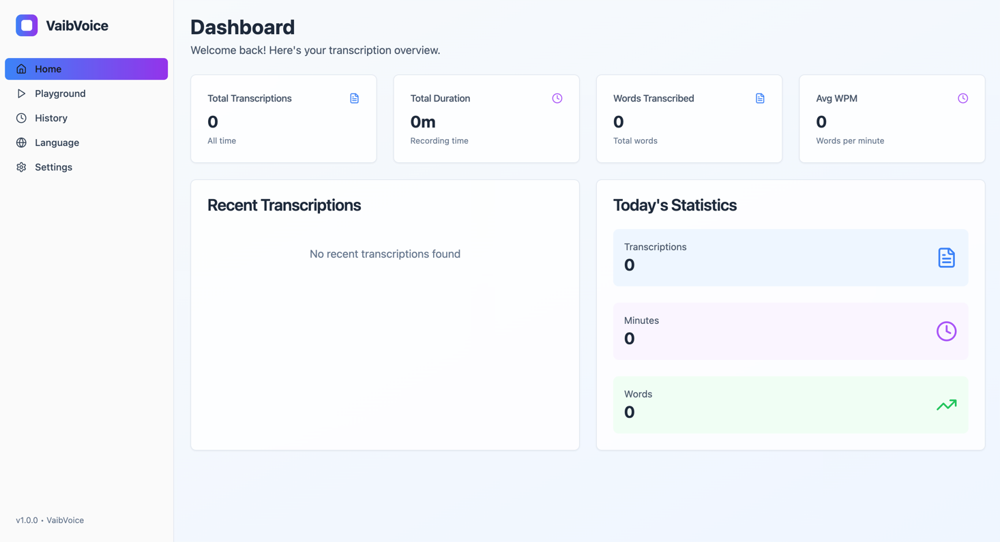

# VaibVoice - AI-Powered Voice Transcription


<p align="center">
  <a href="#installation">Installation</a> •
  <a href="#features">Features</a> •
  <a href="#usage">Usage</a> •
  <a href="#technologies">Technologies</a> •
  <a href="#contributing">Contributing</a> •
  <a href="#license">License</a>
</p>



## 🎙️ What is VaibVoice?

VaibVoice is an advanced AI-powered voice transcription application that converts your speech into intelligently formatted text. Designed to boost productivity, VaibVoice eliminates the need for manual typing while automatically formatting your content based on context.

### 🚀 Problem Solved

- **No More Typing**: Speak naturally and let VaibVoice handle the text conversion
- **Smart Formatting**: Automatically formats emails, messages, and prompts appropriately
- **Time Saving**: Reduce the time spent on writing and formatting content
- **Accessibility**: Makes content creation accessible for everyone, including those with typing difficulties

### 👥 Who Is It For?

- Professionals who need to create content quickly and efficiently
- Individuals with typing difficulties or RSI (Repetitive Strain Injury)
- Anyone looking to boost their writing productivity
- Content creators, programmers, and business professionals

## ✨ Features

### 🎤 Real-Time Voice Transcription
- Powered by OpenAI's GPT-4o models for highly accurate transcription
- Support for multiple languages
- Customizable activation key for recording

### 🧠 Intelligent Formatting
- Automatically detects content type (email, message, prompt)
- Formats text appropriately based on context
- Removes formatting instructions from the final output

### 🖥️ Intuitive User Interface
- Clean, modern dashboard with usage statistics
- Interactive playground for testing transcription
- Comprehensive history management
- Customizable settings

### ⚙️ Personalization Options
- Language selection for transcription
- Configurable recording hotkey
- Customizable notification sounds
- Selection of AI models for transcription and formatting

## 🛠️ Technologies

### Backend
- Python 3.8+
- FastAPI for RESTful API
- SQLite for data storage
- OpenAI API for transcription and formatting

### Frontend
- React with TypeScript
- Tailwind CSS for styling
- Vite as build tool
- shadcn/ui components

## 📋 Installation

### Prerequisites
- Python 3.8 or higher
- Node.js and npm
- OpenAI API key

### Step-by-Step Installation

1. **Clone the repository**
   ```bash
   git clone https://github.com/yourusername/vaibvoice.git
   cd vaibvoice
   ```

2. **Install Python dependencies**
   ```bash
   pip install -r requirements.txt
   ```

3. **Install and build the frontend**
   ```bash
   cd gui
   npm install
   npm run build
   cd ..
   ```

4. **Configure your OpenAI API key**
   - Launch the application
   - Navigate to Settings
   - Enter your OpenAI API key

5. **Run the application**
   ```bash
   python run.py
   ```

## 🎮 Usage

### Initial Setup
1. **Set your OpenAI API key** in the Settings page
2. **Select your preferred language** for transcription
3. **Configure your recording hotkey** (default is Alt)

### Basic Usage
1. Place your cursor where you want the transcription to appear
2. Press and hold your configured hotkey
3. Speak clearly into your microphone
4. Release the key when finished speaking
5. Wait for processing to complete
6. Your formatted text will appear at the cursor position

### Smart Formatting Tips
For best results, start your dictation with instructions like:
- "This is an email to my colleague, format it professionally..."
- "Format this as a casual message to my friend..."
- "This is a prompt for an AI system..."

The AI will understand your instructions, format accordingly, and remove the instructions from the final text.

## 🏗️ Project Architecture

### Directory Structure
```
vaibvoice/
├── gui/                  # Frontend React application
├── vaibvoice/            # Backend Python application
│   ├── api/              # FastAPI routes and endpoints
│   ├── core/             # Core functionality (recording, transcription)
│   ├── db/               # Database models and repositories
│   └── models/           # Data models
├── run.py                # Main entry point
└── requirements.txt      # Python dependencies
```

### Data Flow
1. User activates recording with the configured hotkey
2. Audio is captured and sent to the OpenAI API
3. Transcription is processed and formatted
4. Formatted text is returned to the user interface
5. Transcription is saved to the history database

## 👥 Contributing

We welcome contributions to VaibVoice! Here's how you can help:

### Development Setup
1. Fork the repository
2. Create a feature branch: `git checkout -b feature/amazing-feature`
3. Make your changes
4. Commit your changes: `git commit -m 'Add some amazing feature'`
5. Push to the branch: `git push origin feature/amazing-feature`
6. Open a Pull Request

### Future Roadmap
- Voice activation mode
- Export functionality for transcription history
- Additional language support
- Mobile application
- Cloud synchronization

## 📄 License

This project is licensed under the MIT License - see the LICENSE file for details.


---


<!-- Keywords for SEO -->
<!-- 
Transcription voice AI, Voice-to-text conversion, AI formatting, Productivity tool,
OpenAI GPT-4, Voice assistant, Intelligent dictation, Speech recognition,
Automatic formatting, Voice productivity, AI transcription, Smart voice assistant
-->
